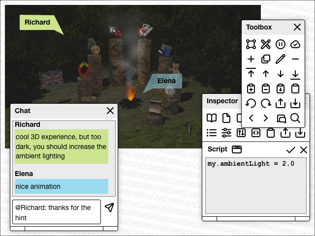

# shareablePatchwork #

(this page is currently just a placeholder for the final development goal, please visit [shareableSketchbook](https://github.com/rozek/shareableSketchbook) for the next development step)

(preliminary Screenshot of a [shareableSketchbook](https://github.com/rozek/shareableSketchbook))

"ShareablePatchwork" (SPW) is a free and open-source, personal, web-based cross-platform creativity workspace. It can be used for note-taking, simulations and animations, as a PowerPoint alternative "on steroids" but also for VR/AR experiences and AI applications.

It works offline but has powerful real-time synchronisation built-in which can be used for seemless handover between different devices or collaboration (even time-shifted) among teams.

Handling is extremely simple: if you are able to build a PowerPoint presentation or use a note-taking application, you can work with SPW. Programming can be done in JavaScript or [Blockly](https://developers.google.com/blockly) (i.e., by dragging and dropping "blocks" without having to learn a programming language) 

SPW aims to implement the fundamental ideas of Apple HyperCard on today's platforms. By lowering the entry barriers as much as possible, it allows non-programmers to realize their own ideas: from customized user interfaces (accessible, less overwhelming) to new applications for modern technologies (incl. VR/AR and AI).

> In brief: it wants to **turn externally determined consumers into self-determined producers**!

## License ##

[MIT License](LICENSE.md)
